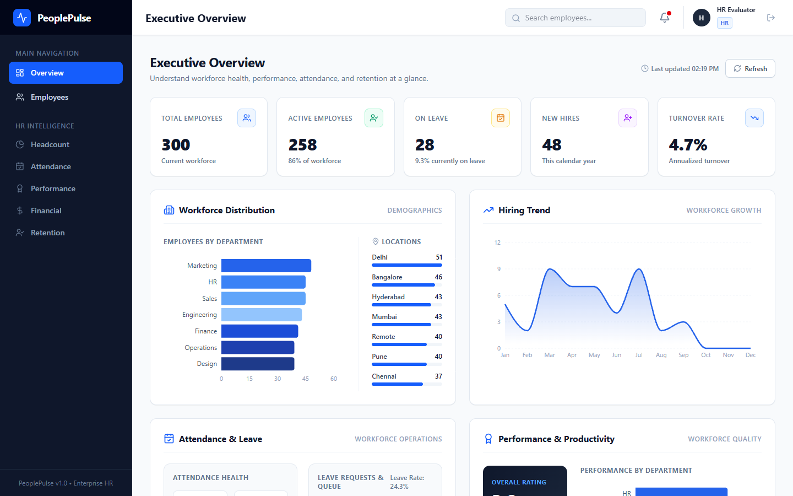
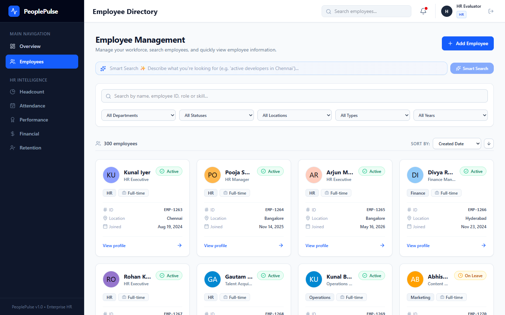
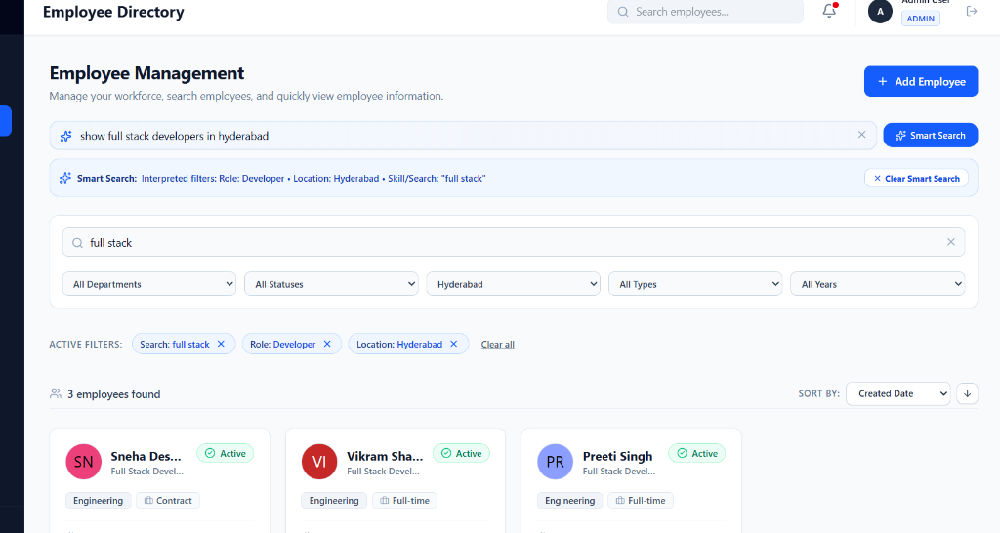
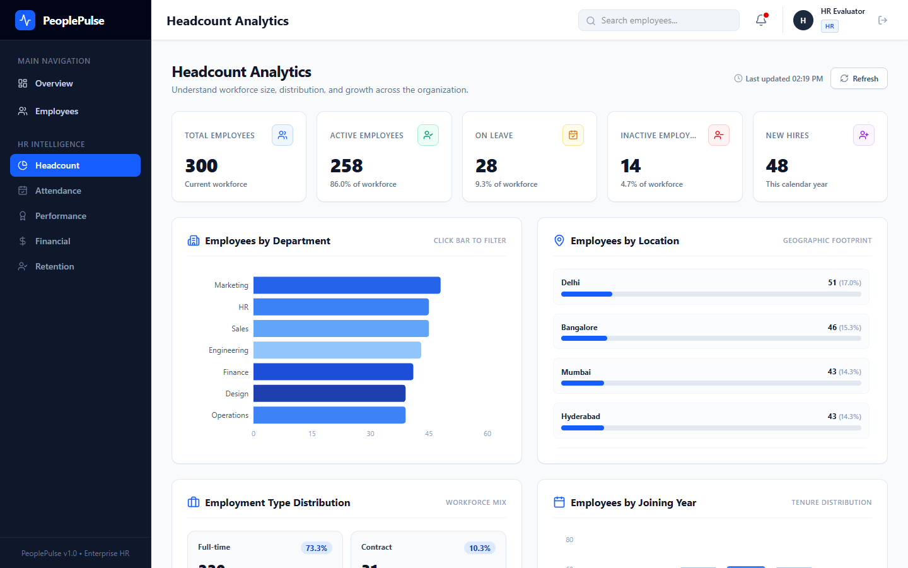
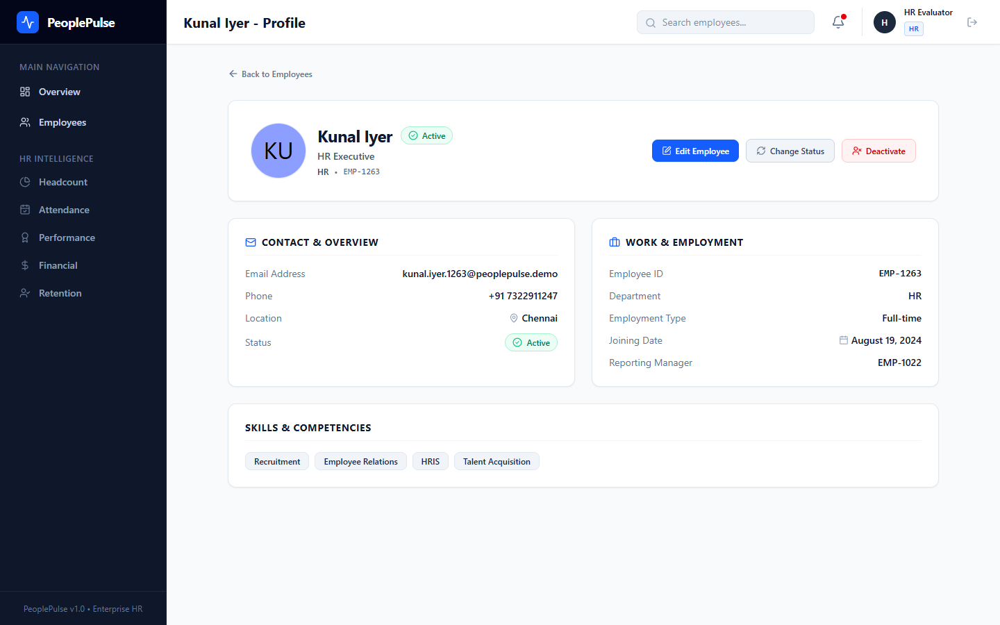

# PeoplePulse — Intelligent Employee Management & HR Analytics

PeoplePulse is a full-stack employee management platform designed to help HR teams streamline daily workforce operations. It enables HR professionals to manage employees, find talent quickly, analyze workforce data, and gain real-time insights into attendance, performance, payroll financial costs, and retention.

## 🔗 Live Demo
Note: The backend is hosted on a free Render instance and may take a short time to wake after inactivity.
**[🚀 Open PeoplePulse Live](https://peoplepulse-phi.vercel.app)**

## 💻 GitHub Repository

**[View Source Code](https://github.com/huzaif-87/peoplepulse)**

---

## 📸 Project Preview

### Executive Dashboard
Shows the overall workforce and HR metrics in one place.


### Employee Directory
Search, filter, sort and manage employees.


### AI Smart Search
Search employees using normal English instead of manually selecting many filters.


### HR Intelligence
Explore headcount, attendance, performance, financial and retention insights.


### Employee Profile
View and manage detailed employee information.


---

## 💡 Project Idea

HR teams often need to search for employees and understand workforce information quickly. PeoplePulse combines employee management with HR analytics so that common HR tasks and workforce insights are available in one platform.

---

# 🎯 Assignment Requirements

### 1. 🤖 AI Research & Usage

I researched how AI could reduce the effort required to search for employees.

Instead of making an HR user select several filters manually, PeoplePulse supports natural-language queries such as:

> *"Show active React developers in Chennai who joined in 2025."*

**Execution Flow:**

```
User's sentence
   ↓
Gemini understands the requested filters
   ↓
Backend validates the extracted filters
   ↓
Backend queries MongoDB
   ↓
Matching employees are displayed
```

**Key Principles:**
- Gemini is used **only** to understand the user's search intent.
- Gemini does **NOT** directly access MongoDB.
- Gemini does **NOT** generate MongoDB queries.
- The backend validates the AI output before searching.
- The Gemini API key is kept securely on the server.

> **Why AI?**
> AI was used here because natural-language search can reduce the number of manual filters an HR user needs to configure.

---

### 2. 🧠 Logical Approach

The development of PeoplePulse followed a systematic step-by-step sequence:

1. Built the basic application structure.
2. Added authentication and role-based access.
3. Built employee search, filtering, sorting, pagination and CRUD.
4. Added HR data such as attendance, leave, performance, payroll and employment history.
5. Built HR analytics from the database.
6. Added AI Smart Search.
7. Optimized slow analytics requests using dedicated APIs and MongoDB indexes.
8. Deployed the frontend and backend separately.

**System Architecture:**

```
User
  ↓
React Frontend
  ↓
Node.js + Express Backend
  │
  ├──> MongoDB Atlas
  │
  └──> Gemini AI
```

*Note: Google Gemini operates strictly as a backend-side service.*

---

### 3. 🎨 Reason for Using the Main Elements

| Element | Why I used it |
|---|---|
| Employee cards | Makes employee information easy to scan |
| Search and filters | Helps HR find employees quickly |
| Pagination | Avoids loading hundreds of employees at once |
| KPI cards | Gives a quick summary of important HR numbers |
| Charts | Makes workforce trends easier to understand |
| Separate HR Intelligence pages | Lets users explore each area without overcrowding the main dashboard |
| Notifications | Brings attention to important items |
| Responsive design | Makes the application usable on different screen sizes |
| AI Smart Search | Makes complex employee searches easier |
| Loading, empty and error states | Makes the application clearer during real-world use |

---

### 4. ⭐ Unique Approach

PeoplePulse goes beyond standard CRUD operations by introducing several key architectural and functional differentiators:

#### A. Natural-Language HR Search
Supports complex multi-criteria queries in a single sentence (e.g., *"Show active React developers in Chennai who joined in 2025"*).

#### B. AI is used for a specific purpose
Instead of adding a generic chatbot, I used AI for a specific HR problem: helping users find employees faster.

#### C. Smart role + skill understanding
A search query such as *"React developers"* intelligently recognizes:
- **Skill:** React
- **Role:** Developer

This ensures candidates with designations like *Frontend Developer* or *Full Stack Developer* who possess *React* in their skill profile are correctly matched.

#### D. HR Intelligence in one platform
Consolidates core workforce domains into a single unified analytics hub:
**Headcount → Attendance & Leave → Performance → Financial → Retention**

#### E. Performance-focused engineering
After testing the application, slow analytics requests were identified and improved using:
- Dedicated, domain-specific analytics endpoints
- Optimized MongoDB database queries
- Indexing on frequently queried fields
- Page-specific frontend data fetching to avoid over-fetching

---

## ⭐ In One Sentence

> **PeoplePulse combines employee management, HR intelligence and natural-language AI search in one workflow, with AI helping users find the right employees without giving the AI direct database access.**

---

## ✨ Key Features

- Employee management and CRUD operations
- Search, filtering, sorting, and pagination
- Natural-language AI employee search
- Headcount analytics
- Attendance and leave analytics
- Performance analytics
- Financial analytics
- Retention and turnover analytics
- Real-time user notifications
- JWT authentication and role-based access control (HR & Admin)
- Fully responsive interface
- Secure server-side Gemini integration

---

## 🛠️ Technology Stack

| Layer | Technologies |
|---|---|
| **Frontend** | React, Vite, TailwindCSS, React Router, Recharts, Lucide Icons |
| **Backend** | Node.js, Express.js, Mongoose |
| **Database** | MongoDB Atlas |
| **AI Integration** | Google Gemini API (via server-side SDK) |
| **Authentication** | JWT (JSON Web Tokens) + bcryptjs |
| **Deployment** | Vercel (Frontend) + Render (Backend) |

---

## 🔐 Security

- **JWT Authentication:** Secure user sessions via token validation.
- **Role-Based Access Control:** Authorization middleware restricting endpoints to authorized roles (HR & Admin).
- **Password Hashing:** Passwords hashed with `bcryptjs` before storage.
- **Server-Side API Keys:** Secrets (`GEMINI_API_KEY`, `MONGO_URI`, `JWT_SECRET`) stored strictly on the backend.
- **MongoDB Query & Operator Validation:** Strict sanitization of AI-generated filters against operator injection (`$where`, `$regex`, etc.).
- **Regex Protection:** User search inputs escaped to prevent Regex ReDoS attacks.
- **HTTP Protection & CORS:** Configured with Helmet and restricted CORS policies.
- **Rate Limiting:** Protects API endpoints against brute force and denial of service.
- **Soft Deletion:** Employee records marked inactive rather than hard deleted to preserve historical integrity.

---

## ⚡ Performance & Engineering

During testing, the original analytics dashboard was making many database operations and HR Intelligence pages were requesting more data than they needed.

Key technical improvements implemented:
- **Domain-Specific Endpoints:** Split consolidated analytics into dedicated domain routes (`/headcount`, `/attendance`, `/performance`, `/financial`, `/retention`).
- **Database Indexing:** Created MongoDB indexes on heavily filtered fields (`status`, `department`, `location`, `hireDate`, `skills`).
- **Lean Queries:** Applied `.lean()` and targeted field selection to reduce database overhead.
- **Data Fetching Optimization:** Prevented duplicate requests and restricted frontend calls to page-specific needs.

---

## 🧪 Testing

Comprehensive test suites verify system reliability across logic, security, and performance:

- **Analytics API:** 26 / 26 tests passed
- **AI Smart Search:** 36 / 36 tests passed
- **Employee Search & Filter:** 32 / 32 tests passed
- **Authentication & RBAC:** 20 / 20 tests passed
- **Employee CRUD API:** Passed
- **Analytics Endpoint Verification:** 7 / 7 tests passed
- **Production Frontend Build:** Passed clean

---

## 📡 API Endpoints

| Endpoint | Method | Access | Description |
|---|---|---|---|
| `/api/auth/register` | POST | Public | User registration |
| `/api/auth/login` | POST | Public | User login & JWT issuance |
| `/api/auth/me` | GET | Protected | Get current user profile |
| `/api/employees` | GET | Protected | Paginated directory listing with filters & search |
| `/api/employees/:id` | GET | Protected | Fetch detailed employee profile |
| `/api/employees` | POST | HR/Admin | Create new employee record |
| `/api/employees/:id` | PUT | HR/Admin | Update employee information |
| `/api/employees/:id/status` | PATCH | HR/Admin | Update employee employment status |
| `/api/employees/:id` | DELETE | HR/Admin | Soft delete / deactivate employee |
| `/api/analytics/dashboard` | GET | Protected | Consolidated HR analytics summary |
| `/api/analytics/headcount` | GET | Protected | Headcount distribution and hiring metrics |
| `/api/analytics/attendance` | GET | Protected | Attendance rates and leave statistics |
| `/api/analytics/performance` | GET | Protected | Performance review metrics and ratings |
| `/api/analytics/financial` | GET | Protected | Payroll costs and salary distribution |
| `/api/analytics/retention` | GET | Protected | Retention rates and turnover analytics |
| `/api/ai/employee-search` | POST | Protected | Natural-language AI employee search |

---

## 🚀 Deployment

- **Frontend:** Vercel
- **Backend:** Render
- **Database:** MongoDB Atlas
- **AI Integration:** Google Gemini API accessed via backend proxy

**[🚀 Open PeoplePulse Live Application](https://peoplepulse-phi.vercel.app)**

---

## ⚙️ Local Setup

### Prerequisites
- Node.js (v18+)
- npm or yarn
- MongoDB instance (Local or MongoDB Atlas)

### 1. Environment Configuration

Create a `.env` file inside the `server/` directory:

```env
PORT=5000
MONGO_URI=your_mongodb_connection_string
JWT_SECRET=your_jwt_secret
JWT_EXPIRES_IN=30m
GEMINI_API_KEY=your_gemini_api_key
GEMINI_MODEL=gemini-1.5-flash
```

*(See `server/.env.example` for details).*

### 2. Installation & Running Locally

**Backend Setup:**
```bash
cd server
npm install
npm run seed:employees   # Seed initial employee dataset
npm run seed:hr          # Seed supporting HR analytics dataset
npm run dev              # Starts Express API server at http://localhost:5000
```

**Frontend Setup:**
```bash
cd client
npm install
npm run dev              # Starts Vite application at http://localhost:5173
```
